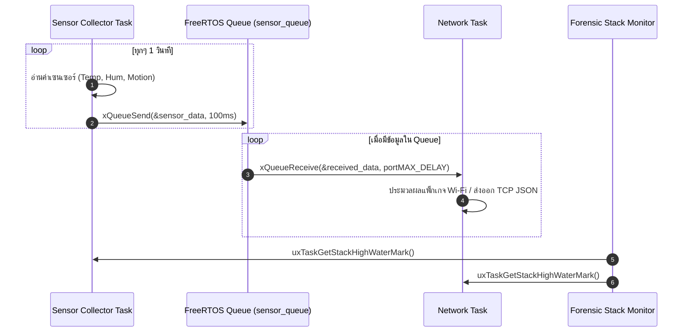

# ใบงานที่ 6.3: การออกแบบ FreeRTOS Task Architecture & Sensor Data Fusion ผ่าน Queue

## 0. กล่าวนำ (Introduction)
ในแอปพลิเคชัน IoT ระดับอุตสาหกรรม โปรแกรมเมอร์จะไม่เขียนโค้ดอ่านค่าเซนเซอร์และการรับส่งข้อมูล Wi-Fi รวมไว้ในฟังก์ชันเดียวกัน เพราะจะทำให้สแตกระบบเครือข่ายชะงัก (Network Latency & Blocking) 

ในใบงานนี้นักศึกษาจะได้ออกแบบสถาปัตยกรรม **FreeRTOS Multi-Tasking** โดยแยกโปรแกรมออกเป็น **Sensor Collector Task** และ **Network Communication Task** แล้วใช้ **FreeRTOS Queue** เป็นสะพานเชื่อมส่งผ่านโครงสร้างข้อมูล `sensor_data_t` อย่างปลอดภัย (Thread-Safe) พร้อมทั้งใช้คำสั่ง Forensic ตรวจวัดหน่วยความจำสแตก `uxTaskGetStackHighWaterMark()`

---

## 1. วัตถุประสงค์ (Objectives)
1. สามารถสร้างและบริหารจัดการ FreeRTOS Tasks บน ESP-IDF ด้วยฟังก์ชัน `xTaskCreate()` ได้
2. สามารถสร้างและใช้งาน FreeRTOS Queue (`xQueueCreate`, `xQueueSend`, `xQueueReceive`) ในการส่งผ่านข้อมูลได้
3. ป้องกันปัญหาการบล็อกระบบเครือข่าย Wi-Fi โดยการแยกงานอ่านเซนเซอร์ออกจาก Network Loop
4. ประเมินการใช้หน่วยความจำสแตกของแต่ละ Task ในสไตล์ Forensic ด้วย `uxTaskGetStackHighWaterMark()`

---

## 2. อุปกรณ์และซอฟต์แวร์ที่ใช้ในการทดลอง (Equipment & Tools)
1. บอร์ดไมโครคอนโทรลเลอร์ ESP32 จำนวน 1 บอร์ด
2. สายเชื่อมต่อ Micro-USB หรือ USB-C จำนวน 1 เส้น
3. โปรแกรม IDE เช่น VS Code พร้อม ESP-IDF Toolchain

---

## 3. สถาปัตยกรรมระบบ (System Architecture & Sequence)



---

## 4. ขั้นตอนการทดลอง (Experimental Procedures)

1. นำซอร์สโค้ดในข้อ 5 ไปวางในไฟล์ `main/main.c` ทำการ Build และ Flash ลงบอร์ด ESP32
2. สังเกต Forensic Log ใน Serial Monitor:
   - ตรวจดูข้อมูลที่ถูกส่งจาก `vSensorTask` เข้าสู่ Queue และถูกรับโดย `vNetworkTask`
   - ตรวจดูค่า **Stack High Water Mark** (ขนาดสแตกคงเหลือ) ของแต่ละ Task
3. ทดลองปรับขนาดสแตกของ `vSensorTask` ใน `xTaskCreate()` จาก `4096` ลดลงเหลือ `1024` สังเกตค่า High Water Mark และวิเคราะห์จุดเสี่ยง Stack Overflow

---

## 5. ซอร์สโค้ดการทดลอง (Complete ESP-IDF Source Code - `main.c`)

```c
#include <stdio.h>
#include <string.h>
#include "freertos/FreeRTOS.h"
#include "freertos/task.h"
#include "freertos/queue.h"
#include "esp_system.h"
#include "esp_log.h"
#include "esp_random.h"

static const char *TAG = "LAB_FREERTOS_QUEUE";

// Sensor Data Structure
typedef struct {
    float temperature;
    float humidity;
    uint32_t light_lux;
    uint32_t timestamp_ms;
} sensor_data_t;

// Queue Handle
static QueueHandle_t xSensorQueue = NULL;

// ------------------------------------------------------------------
// Task 1: Sensor Collector Task (Simulates Reading Hardware Sensors)
// ------------------------------------------------------------------
void vSensorTask(void *pvParameters) {
    sensor_data_t data;
    ESP_LOGI(TAG, "[TASK CREATED]: Sensor Collector Task Started on Core %d", xPortGetCoreID());

    while (1) {
        // 1. Simulate reading sensors
        data.temperature = 25.0f + (esp_random() % 100) / 10.0f;
        data.humidity = 50.0f + (esp_random() % 200) / 10.0f;
        data.light_lux = 200 + (esp_random() % 500);
        data.timestamp_ms = xTaskGetTickCount() * portTICK_PERIOD_MS;

        ESP_LOGI(TAG, "[SENSOR TASK]: Pushing Data -> Temp: %.1f C, Hum: %.1f %%, Lux: %ld",
                 data.temperature, data.humidity, data.light_lux);

        // 2. Send data structure to FreeRTOS Queue
        if (xQueueSend(xSensorQueue, &data, pdMS_TO_TICKS(100)) != pdPASS) {
            ESP_LOGW(TAG, "[QUEUE WARNING]: Queue Full! Failed to push sensor data.");
        }

        // 3. Stack High Water Mark Check
        UBaseType_t hwm = uxTaskGetStackHighWaterMark(NULL);
        ESP_LOGI("FORENSIC_STACK", "  -> SensorTask Stack Remaining: %u words (%u bytes)",
                 hwm, hwm * sizeof(StackType_t));

        vTaskDelay(pdMS_TO_TICKS(1500));
    }
}

// ------------------------------------------------------------------
// Task 2: Network Task (Consumes Data from Queue for Wi-Fi Transmission)
// ------------------------------------------------------------------
void vNetworkTask(void *pvParameters) {
    sensor_data_t rx_data;
    ESP_LOGI(TAG, "[TASK CREATED]: Network Task Started on Core %d", xPortGetCoreID());

    while (1) {
        // Wait indefinitely for data from Queue
        if (xQueueReceive(xSensorQueue, &rx_data, portMAX_DELAY) == pdTRUE) {
            ESP_LOGI(TAG, "=======================================================");
            ESP_LOGI(TAG, "[NETWORK TASK]: Data Received from Queue!");
            ESP_LOGI(TAG, "  -> Timestamp   : %ld ms", rx_data.timestamp_ms);
            ESP_LOGI(TAG, "  -> Temperature : %.2f degC", rx_data.temperature);
            ESP_LOGI(TAG, "  -> Humidity    : %.2f %%", rx_data.humidity);
            ESP_LOGI(TAG, "  -> Light Lux   : %ld lux", rx_data.light_lux);
            ESP_LOGI(TAG, "[NETWORK TASK]: Preparing JSON Packet for Wi-Fi Transmission...");
            ESP_LOGI(TAG, "=======================================================");
        }

        UBaseType_t hwm = uxTaskGetStackHighWaterMark(NULL);
        ESP_LOGI("FORENSIC_STACK", "  -> NetworkTask Stack Remaining: %u words (%u bytes)",
                 hwm, hwm * sizeof(StackType_t));
    }
}

void app_main(void) {
    ESP_LOGI(TAG, "==================================================================");
    ESP_LOGI(TAG, "  Lab 6.3: FreeRTOS Multi-Tasking & Sensor Data Queue Fusion");
    ESP_LOGI(TAG, "==================================================================");

    // Create FreeRTOS Queue for 10 items of sensor_data_t
    xSensorQueue = xQueueCreate(10, sizeof(sensor_data_t));
    if (xSensorQueue == NULL) {
        ESP_LOGE(TAG, "Failed to create FreeRTOS Queue!");
        return;
    }

    // Create Tasks
    xTaskCreate(vSensorTask, "SensorCollectorTask", 3072, NULL, 5, NULL);
    xTaskCreate(vNetworkTask, "NetworkCommTask", 4096, NULL, 4, NULL);
}
```

---

## 6. ตารางบันทึกผลการทดลอง (Experiment Results)

### 6.1 บันทึกข้อมูล Forensic Stack High Water Mark

| ชื่อ FreeRTOS Task | ขนาด Stack ที่กำหนดใน `xTaskCreate` (Bytes) | ค่า High Water Mark ที่อ่านได้ (Words / Bytes) | สถานะความปลอดภัยสแตก |
| :--- | :---: | :---: | :---: |
| **`SensorCollectorTask`** | 3072 | 2028|ปลอดภัย (Safe) |
| **`NetworkCommTask`** | 4096 |3080 |ปลอดภัย (Safe)|

---
ผลการทดลอง
```
I (27) boot: ESP-IDF v6.0.2 2nd stage bootloader
I (27) boot: compile time Aug 10 2026 16:38:00
I (28) boot: Multicore bootloader
I (29) boot: chip revision: v3.1
I (32) boot.esp32: SPI Speed      : 40MHz
I (35) boot.esp32: SPI Mode       : DIO
I (39) boot.esp32: SPI Flash Size : 2MB
I (42) boot: Enabling RNG early entropy source...
I (47) boot: Partition Table:
I (49) boot: ## Label            Usage          Type ST Offset   Length
I (56) boot:  0 nvs              WiFi data        01 02 00009000 00006000
I (62) boot:  1 phy_init         RF data          01 01 0000f000 00001000
I (69) boot:  2 factory          factory app      00 00 00010000 00100000
I (75) boot: End of partition table
I (79) esp_image: segment 0: paddr=00010020 vaddr=3f400020 size=08938h ( 35128) map
I (99) esp_image: segment 1: paddr=00018960 vaddr=3ffb0000 size=029fch ( 10748) load
I (103) esp_image: segment 2: paddr=0001b364 vaddr=40080000 size=04cb4h ( 19636) load
I (111) esp_image: segment 3: paddr=00020020 vaddr=400d0020 size=0c3b0h ( 50096) map
I (130) esp_image: segment 4: paddr=0002c3d8 vaddr=40084cb4 size=05fe4h ( 24548) load
I (140) esp_image: segment 5: paddr=000323c4 vaddr=50000000 size=00028h (    40) load
I (146) boot: Loaded app from partition at offset 0x10000
I (146) boot: Disabling RNG early entropy source...
I (158) cpu_start: Multicore app
I (166) cpu_start: GPIO 3 and 1 are used as console UART I/O pins
I (167) cpu_start: Pro cpu start user code
I (167) cpu_start: cpu freq: 160000000 Hz
I (168) app_init: Application information:
I (172) app_init: Project name:     rssi_speed_profiler
I (177) app_init: App version:      1
I (181) app_init: Compile time:     Aug 10 2026 16:37:38
I (186) app_init: ELF file SHA256:  e0011ab9a...
I (190) app_init: ESP-IDF:          v6.0.2
I (194) efuse_init: Min chip rev:     v0.0
I (198) efuse_init: Max chip rev:     v3.99 
I (202) efuse_init: Chip rev:         v3.1
I (206) heap_init: Initializing. RAM available for dynamic allocation:
I (212) heap_init: At 3FFAE6E0 len 00001920 (6 KiB): DRAM
I (217) heap_init: At 3FFB33A8 len 0002CC58 (179 KiB): DRAM
I (222) heap_init: At 3FFE0440 len 00003AE0 (14 KiB): D/IRAM
I (227) heap_init: At 3FFE4350 len 0001BCB0 (111 KiB): D/IRAM
I (233) heap_init: At 4008AC98 len 00015368 (84 KiB): IRAM
I (240) spi_flash: detected chip: generic
I (242) spi_flash: flash io: dio
W (245) spi_flash: Detected size(4096k) larger than the size in the binary image header(2048k). Using the size in the binary image header.
I (258) main_task: Started on CPU0
I (258) main_task: Calling app_main()
I (258) LAB_FREERTOS_QUEUE: ==================================================================
I (268) LAB_FREERTOS_QUEUE:   Lab 6.3: FreeRTOS Multi-Tasking & Sensor Data Queue Fusion
I (278) LAB_FREERTOS_QUEUE: ==================================================================
I (278) LAB_FREERTOS_QUEUE: [TASK CREATED]: Sensor Collector Task Started on Core 0
I (288) LAB_FREERTOS_QUEUE: [SENSOR TASK]: Pushing Data -> Temp: 33.2 C, Hum: 57.5 %, Lux: 294
I (298) FORENSIC_STACK:   -> SensorTask Stack Remaining: 2028 words (2028 bytes)
I (308) LAB_FREERTOS_QUEUE: [TASK CREATED]: Network Task Started on Core 0
I (308) LAB_FREERTOS_QUEUE: =======================================================
I (318) LAB_FREERTOS_QUEUE: [NETWORK TASK]: Data Received from Queue!
I (328) LAB_FREERTOS_QUEUE:   -> Timestamp   : 30 ms
I (328) LAB_FREERTOS_QUEUE:   -> Temperature : 33.20 degC
I (338) LAB_FREERTOS_QUEUE:   -> Humidity    : 57.50 %
I (338) LAB_FREERTOS_QUEUE:   -> Light Lux   : 294 lux
I (348) LAB_FREERTOS_QUEUE: [NETWORK TASK]: Preparing JSON Packet for Wi-Fi Transmission...
I (358) LAB_FREERTOS_QUEUE: =======================================================
I (358) FORENSIC_STACK:   -> NetworkTask Stack Remaining: 3080 words (3080 bytes)
I (368) main_task: Returned from app_main()
I (1808) LAB_FREERTOS_QUEUE: [SENSOR TASK]: Pushing Data -> Temp: 28.9 C, Hum: 53.6 %, Lux: 337
I (1808) FORENSIC_STACK:   -> SensorTask Stack Remaining: 2028 words (2028 bytes)
I (1808) LAB_FREERTOS_QUEUE: =======================================================
I (1818) LAB_FREERTOS_QUEUE: [NETWORK TASK]: Data Received from Queue!
I (1818) LAB_FREERTOS_QUEUE:   -> Timestamp   : 1550 ms
I (1828) LAB_FREERTOS_QUEUE:   -> Temperature : 28.90 degC
I (1828) LAB_FREERTOS_QUEUE:   -> Humidity    : 53.60 %
I (1838) LAB_FREERTOS_QUEUE:   -> Light Lux   : 337 lux
I (1838) LAB_FREERTOS_QUEUE: [NETWORK TASK]: Preparing JSON Packet for Wi-Fi Transmission...
I (1848) LAB_FREERTOS_QUEUE: =======================================================
I (1858) FORENSIC_STACK:   -> NetworkTask Stack Remaining: 3080 words (3080 bytes)
I (3308) LAB_FREERTOS_QUEUE: [SENSOR TASK]: Pushing Data -> Temp: 25.8 C, Hum: 68.2 %, Lux: 680
I (3308) LAB_FREERTOS_QUEUE: =======================================================
I (3308) FORENSIC_STACK:   -> SensorTask Stack Remaining: 2028 words (2028 bytes)
I (3308) LAB_FREERTOS_QUEUE: [NETWORK TASK]: Data Received from Queue!
I (3318) LAB_FREERTOS_QUEUE:   -> Timestamp   : 3050 ms
I (3328) LAB_FREERTOS_QUEUE:   -> Temperature : 25.80 degC
I (3328) LAB_FREERTOS_QUEUE:   -> Humidity    : 68.20 %
I (3338) LAB_FREERTOS_QUEUE:   -> Light Lux   : 680 lux
I (3338) LAB_FREERTOS_QUEUE: [NETWORK TASK]: Preparing JSON Packet for Wi-Fi Transmission...
I (3348) LAB_FREERTOS_QUEUE: =======================================================
I (3358) FORENSIC_STACK:   -> NetworkTask Stack Remaining: 3080 words (3080 bytes)
I (4818) LAB_FREERTOS_QUEUE: [SENSOR TASK]: Pushing Data -> Temp: 32.4 C, Hum: 56.6 %, Lux: 681
I (4818) LAB_FREERTOS_QUEUE: =======================================================
I (4818) FORENSIC_STACK:   -> SensorTask Stack Remaining: 2028 words (2028 bytes)
I (4818) LAB_FREERTOS_QUEUE: [NETWORK TASK]: Data Received from Queue!
I (4828) LAB_FREERTOS_QUEUE:   -> Timestamp   : 4560 ms
I (4838) LAB_FREERTOS_QUEUE:   -> Temperature : 32.40 degC
I (4838) LAB_FREERTOS_QUEUE:   -> Humidity    : 56.60 %
I (4848) LAB_FREERTOS_QUEUE:   -> Light Lux   : 681 lux
I (4848) LAB_FREERTOS_QUEUE: [NETWORK TASK]: Preparing JSON Packet for Wi-Fi Transmission...
I (4858) LAB_FREERTOS_QUEUE: =======================================================
I (4868) FORENSIC_STACK:   -> NetworkTask Stack Remaining: 3080 words (3080 bytes)
I (6328) LAB_FREERTOS_QUEUE: [SENSOR TASK]: Pushing Data -> Temp: 34.0 C, Hum: 61.5 %, Lux: 275
I (6328) LAB_FREERTOS_QUEUE: =======================================================
I (6328) FORENSIC_STACK:   -> SensorTask Stack Remaining: 2028 words (2028 bytes)
I (6328) LAB_FREERTOS_QUEUE: [NETWORK TASK]: Data Received from Queue!
I (6338) LAB_FREERTOS_QUEUE:   -> Timestamp   : 6070 ms
I (6348) LAB_FREERTOS_QUEUE:   -> Temperature : 34.00 degC
I (6348) LAB_FREERTOS_QUEUE:   -> Humidity    : 61.50 %
I (6358) LAB_FREERTOS_QUEUE:   -> Light Lux   : 275 lux
I (6358) LAB_FREERTOS_QUEUE: [NETWORK TASK]: Preparing JSON Packet for Wi-Fi Transmission...
I (6368) LAB_FREERTOS_QUEUE: =======================================================
I (6378) FORENSIC_STACK:   -> NetworkTask Stack Remaining: 3080 words (3080 bytes)
I (7838) LAB_FREERTOS_QUEUE: [SENSOR TASK]: Pushing Data -> Temp: 29.6 C, Hum: 68.1 %, Lux: 239
I (7838) LAB_FREERTOS_QUEUE: =======================================================
I (7838) FORENSIC_STACK:   -> SensorTask Stack Remaining: 2028 words (2028 bytes)
I (7838) LAB_FREERTOS_QUEUE: [NETWORK TASK]: Data Received from Queue!
I (7848) LAB_FREERTOS_QUEUE:   -> Timestamp   : 7580 ms
I (7858) LAB_FREERTOS_QUEUE:   -> Temperature : 29.60 degC
I (7858) LAB_FREERTOS_QUEUE:   -> Humidity    : 68.10 %
I (7868) LAB_FREERTOS_QUEUE:   -> Light Lux   : 239 lux
I (7868) LAB_FREERTOS_QUEUE: [NETWORK TASK]: Preparing JSON Packet for Wi-Fi Transmission...
I (7878) LAB_FREERTOS_QUEUE: =======================================================
I (7888) FORENSIC_STACK:   -> NetworkTask Stack Remaining: 3080 words (3080 bytes)
I (9348) LAB_FREERTOS_QUEUE: [SENSOR TASK]: Pushing Data -> Temp: 27.3 C, Hum: 51.5 %, Lux: 220
I (9348) LAB_FREERTOS_QUEUE: =======================================================
I (9348) FORENSIC_STACK:   -> SensorTask Stack Remaining: 2028 words (2028 bytes)
I (9348) LAB_FREERTOS_QUEUE: [NETWORK TASK]: Data Received from Queue!
I (9358) LAB_FREERTOS_QUEUE:   -> Timestamp   : 9090 ms
I (9368) LAB_FREERTOS_QUEUE:   -> Temperature : 27.30 degC
I (9368) LAB_FREERTOS_QUEUE:   -> Humidity    : 51.50 %
I (9378) LAB_FREERTOS_QUEUE:   -> Light Lux   : 220 lux
I (9378) LAB_FREERTOS_QUEUE: [NETWORK TASK]: Preparing JSON Packet for Wi-Fi Transmission...
I (9388) LAB_FREERTOS_QUEUE: =======================================================
I (9398) FORENSIC_STACK:   -> NetworkTask Stack Remaining: 3080 words (3080 bytes)
I (10858) LAB_FREERTOS_QUEUE: [SENSOR TASK]: Pushing Data -> Temp: 30.5 C, Hum: 54.0 %, Lux: 393
I (10858) LAB_FREERTOS_QUEUE: =======================================================
I (10858) FORENSIC_STACK:   -> SensorTask Stack Remaining: 2028 words (2028 bytes)
I (10858) LAB_FREERTOS_QUEUE: [NETWORK TASK]: Data Received from Queue!
I (10868) LAB_FREERTOS_QUEUE:   -> Timestamp   : 10600 ms
I (10878) LAB_FREERTOS_QUEUE:   -> Temperature : 30.50 degC
I (10878) LAB_FREERTOS_QUEUE:   -> Humidity    : 54.00 %
I (10888) LAB_FREERTOS_QUEUE:   -> Light Lux   : 393 lux
I (10888) LAB_FREERTOS_QUEUE: [NETWORK TASK]: Preparing JSON Packet for Wi-Fi Transmission...
I (10898) LAB_FREERTOS_QUEUE: =======================================================
I (10908) FORENSIC_STACK:   -> NetworkTask Stack Remaining: 3080 words (3080 bytes)
I (12368) LAB_FREERTOS_QUEUE: [SENSOR TASK]: Pushing Data -> Temp: 31.9 C, Hum: 57.4 %, Lux: 628
I (12368) LAB_FREERTOS_QUEUE: =======================================================
I (12368) FORENSIC_STACK:   -> SensorTask Stack Remaining: 2028 words (2028 bytes)
I (12368) LAB_FREERTOS_QUEUE: [NETWORK TASK]: Data Received from Queue!
I (12378) LAB_FREERTOS_QUEUE:   -> Timestamp   : 12110 ms
I (12388) LAB_FREERTOS_QUEUE:   -> Temperature : 31.90 degC
I (12388) LAB_FREERTOS_QUEUE:   -> Humidity    : 57.40 %
I (12398) LAB_FREERTOS_QUEUE:   -> Light Lux   : 628 lux
I (12398) LAB_FREERTOS_QUEUE: [NETWORK TASK]: Preparing JSON Packet for Wi-Fi Transmission...
I (12408) LAB_FREERTOS_QUEUE: =======================================================
I (12418) FORENSIC_STACK:   -> NetworkTask Stack Remaining: 3080 words (3080 bytes)
I (13878) LAB_FREERTOS_QUEUE: [SENSOR TASK]: Pushing Data -> Temp: 30.1 C, Hum: 56.8 %, Lux: 230
I (13878) LAB_FREERTOS_QUEUE: =======================================================
I (13878) FORENSIC_STACK:   -> SensorTask Stack Remaining: 2028 words (2028 bytes)
I (13878) LAB_FREERTOS_QUEUE: [NETWORK TASK]: Data Received from Queue!
I (13888) LAB_FREERTOS_QUEUE:   -> Timestamp   : 13620 ms
I (13898) LAB_FREERTOS_QUEUE:   -> Temperature : 30.10 degC
I (13898) LAB_FREERTOS_QUEUE:   -> Humidity    : 56.80 %
I (13908) LAB_FREERTOS_QUEUE:   -> Light Lux   : 230 lux
I (13908) LAB_FREERTOS_QUEUE: [NETWORK TASK]: Preparing JSON Packet for Wi-Fi Transmission...
I (13918) LAB_FREERTOS_QUEUE: =======================================================
I (13928) FORENSIC_STACK:   -> NetworkTask Stack Remaining: 3080 words (3080 bytes)
I (15388) LAB_FREERTOS_QUEUE: [SENSOR TASK]: Pushing Data -> Temp: 28.7 C, Hum: 65.9 %, Lux: 530
I (15388) LAB_FREERTOS_QUEUE: =======================================================
I (15388) FORENSIC_STACK:   -> SensorTask Stack Remaining: 2028 words (2028 bytes)
I (15388) LAB_FREERTOS_QUEUE: [NETWORK TASK]: Data Received from Queue!
I (15398) LAB_FREERTOS_QUEUE:   -> Timestamp   : 15130 ms
I (15408) LAB_FREERTOS_QUEUE:   -> Temperature : 28.70 degC
I (15408) LAB_FREERTOS_QUEUE:   -> Humidity    : 65.90 %
I (15418) LAB_FREERTOS_QUEUE:   -> Light Lux   : 530 lux
I (15418) LAB_FREERTOS_QUEUE: [NETWORK TASK]: Preparing JSON Packet for Wi-Fi Transmission...
I (15428) LAB_FREERTOS_QUEUE: =======================================================
I (15438) FORENSIC_STACK:   -> NetworkTask Stack Remaining: 3080 words (3080 bytes)
I (16898) LAB_FREERTOS_QUEUE: [SENSOR TASK]: Pushing Data -> Temp: 25.1 C, Hum: 65.5 %, Lux: 242
I (16898) LAB_FREERTOS_QUEUE: =======================================================
I (16898) FORENSIC_STACK:   -> SensorTask Stack Remaining: 2028 words (2028 bytes)
I (16898) LAB_FREERTOS_QUEUE: [NETWORK TASK]: Data Received from Queue!
I (16908) LAB_FREERTOS_QUEUE:   -> Timestamp   : 16640 ms
I (16918) LAB_FREERTOS_QUEUE:   -> Temperature : 25.10 degC
I (16918) LAB_FREERTOS_QUEUE:   -> Humidity    : 65.50 %
I (16928) LAB_FREERTOS_QUEUE:   -> Light Lux   : 242 lux
I (16928) LAB_FREERTOS_QUEUE: [NETWORK TASK]: Preparing JSON Packet for Wi-Fi Transmission...
I (16938) LAB_FREERTOS_QUEUE: =======================================================
I (16948) FORENSIC_STACK:   -> NetworkTask Stack Remaining: 3080 words (3080 bytes)
```
---
## 7. คำถามท้ายการทดลอง (Post-Lab Questions)

1. เหตุใดการใช้ **FreeRTOS Queue** จึงมีความปลอดภัย (Thread-Safe) มากกว่าการใช้ตัวแปรแบบ Global ในการรับส่งข้อมูลระหว่างสอง Task?
2. ค่า **Stack High Water Mark** มีประโยชน์อย่างไรในการตรวจวินิจฉัยปัญหาบั๊กในระบบเรียลไทม์ (RTOS)?
3. หาก `vSensorTask` ส่งข้อมูลเร็วมาก (เช่น ทุก 10ms) แต่ `vNetworkTask` ส่งข้อมูลออก Wi-Fi ได้ช้า (เช่น ใช้เวลา 500ms) จะเกิดอะไรขึ้นกับ Queue และระบบจะรับมืออย่างไร?
